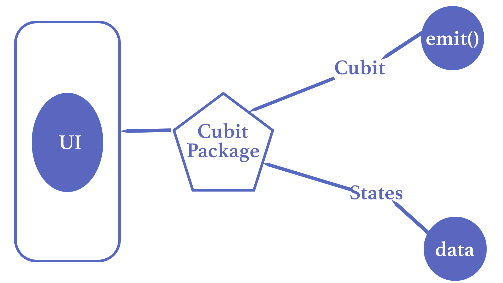
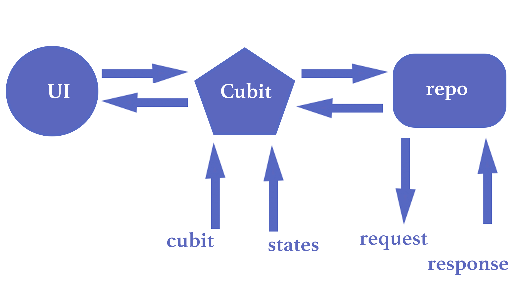
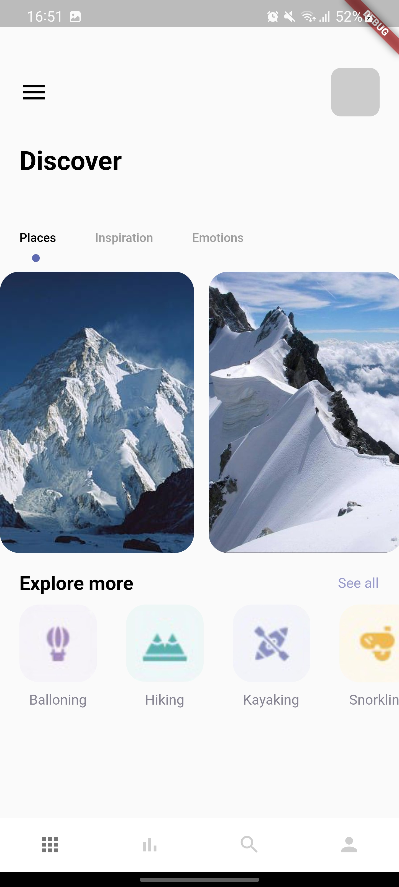
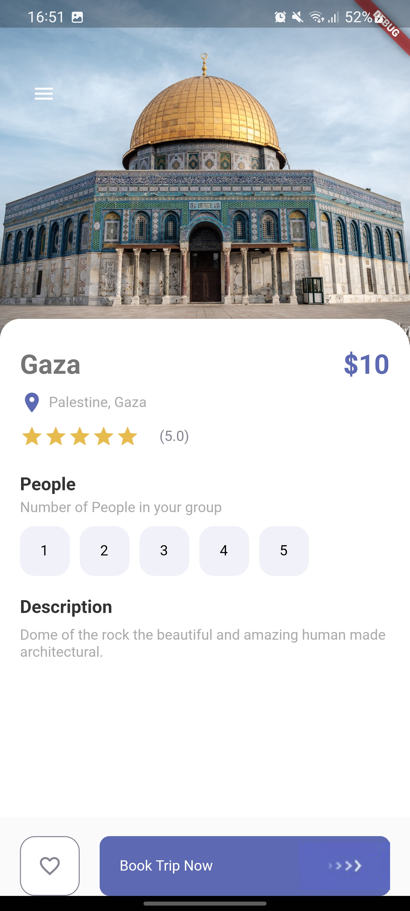

# Tembea

A Flutter app to demonstrate use of cubit packages in flutter.

### Cubit 

Cubit is similar to Bloc but has no notion of events and relies on methods to emit new states. It has states and emits them based on request. 

#### Cubit app Architecture

 
 

## Tembea Screens 

## Getting Started

This project is a starting point for a Flutter application.

A few resources to get you started if this is your first Flutter project:

- [Lab: Write your first Flutter app](https://flutter.dev/docs/get-started/codelab)
- [Cookbook: Useful Flutter samples](https://flutter.dev/docs/cookbook)

For help getting started with Flutter, view our
[online documentation](https://flutter.dev/docs), which offers tutorials,
samples, guidance on mobile development, and a full API reference.
